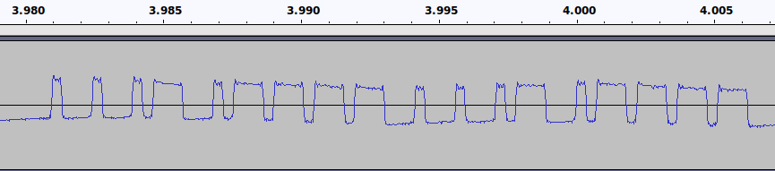

# Data Frame

`01010011001010101101010011001010101`

* `0` = Short Pulse = `475 microseconds`
* `1` = Long Pulse = `1435 microseconds`

The bit is toggeled on each pulse

Initially `LOW`, then toggeled to `HIGH` on first pulse.
Stays `HIGH` for the duration of the pulse. Then repeat toggle and delay.