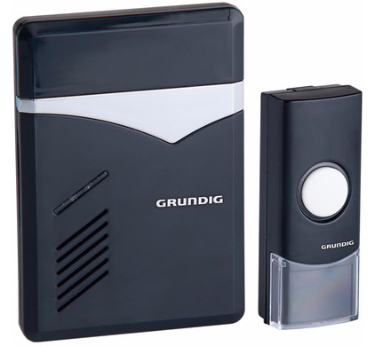

# Wireless Doorbell Clone

Reverse engineering a [Grundig wireless doorbell](https://www.coolblue.nl/product/764783/grundig-draadloze-deurbel-1-ontvanger-netstroom.html) and cloning it's remote so that it can be triggered remotely.

Obviously to prank some unsuspecting victims :grin:

## Requirements

### Hardware

* A Software Defined Radio
* Arduino or MicroPython Compatible Board
* [433 Mhz ASK transmitter](https://www.seeedstudio.com/433MHz-ASK-OOK-Transmitter-module-p-2206.html)

### Software

* [GQRX](https://github.com/csete/gqrx)
* [Audacity](https://www.audacityteam.org)
* [Arduino IDE](https://www.arduino.cc/en/Main/Software)

## Usage

### Arduino

Flash the contents of `firmware/arduino/remote-trigger` to your arduino board.

### MicroPython

Flash the contents of `firmware/micropython/remote-trigger` to your arduino board.
